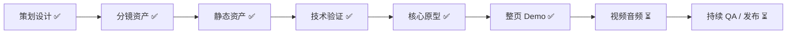

<div align="center">

# 请替我沉默 / Keep Silent For Me

### *你是她没有说出口的那个人。*

[](https://leihuo.163.com/)
[](https://github.com/AvrovaDonz2026/KeepSilentForMe)
[](https://github.com/AvrovaDonz2026/KeepSilentForMe)

**一款约30分钟的语言寄生解谜游戏**

[📖 策划案/组装手册](./schedule.md) • [📝 台本](./台本.md) • [🎨 美术规范](./art-style.md) • [💡 卖点](./selling-points.md) • [🎬 分镜](./storyboard/)

</div>

---

## 📖 项目简介

《请替我沉默》是一款约30-36分钟的短篇叙事解谜游戏。玩家扮演寄生在少女语言里的"消音"，通过唯一的操作——**拖动黑条遮掉句子中的部分文字**——来帮助她在面试、直播、社交等场景中说出"正确"的话。

被遮掉的文字不会消失，而是被你"吃掉"，逐渐在她身边长成你的身体。她靠你的沉默活在社会里，你靠她没说出口的真实想法活下来。

**最新进展** (2026-08-25更新)：
- ✅ **可玩竖切 Demo 已完成**：标题封面、L0-L5、35句台词、拖拽遮字和四个结局均可运行
- ✅ 运行时改为整页场景翻页：13张 `1536×1024` 页面由 `pageBindings` 驱动
- ✅ 已接入继续/重新开始、`localStorage` 存档、URL 调试入口和 Web Audio 提示音
- ✅ 已接入“语言胃 / Echo Digest”：L1-L4 关末把本章吞下的字编排成私语，并在下一章首句旁回声显示；支持鼠标/触摸拖拽、重复碎片和刷新恢复
- ✅ L2/L4 直播已加入独立滚屏评论：随台词切换观众文本、人数持续波动，吸附后的反馈会进入滚屏，桌面与移动端均适配
- ✅ 已接入 4 首 CC0 本地 BGM：雨夜环境、直播压迫、门厅悬疑、终局余响；章节切换交叉淡化，右上角支持总开关、独立音量调节和持久化
- ✅ V4 可玩资产包共 55 件，整页场景包共 13 件，manifest、尺寸和引用校验通过
- ✅ 章节数据校验、重复 zone 定位、存档边界、禁用存储降级和小屏滚屏布局已加固
- ✅ Pages/Tauri 产物同步包含 `art/bg/` 兼容背景；Tauri 提交 `Cargo.lock` 并固定 Rust 1.88.0
- ✅ 已整理 MiniMax H3 的 11 条图生视频提示词、首帧映射、负面提示和生成参数
- ✅ GitHub Pages 最新部署成功；Tauri Windows/Linux 打包工作流最新运行成功
- ✅ 已接入 K01-K22 视频：L0-L4 七条章节过场、A/B/C 结局序列和 K21→K22 反转均由运行时视频 manifest 驱动
- ✅ 首轮多语言已接入：简体中文、English、Deutsch、Русский；封面和游戏内均可即时切换，英文/德文/俄文以 Beta 标记
- ✅ 存档升级为稳定章节/台词/zone ID；切换语言会保留进度、旗标、结局与私语顺序，不再保存某种语言的显示文本
- ✅ 章节结算已按台本对齐：L2 `hate_leak<2` 失败重试、L4 表演/硬刚过场分支、L5_S03 `ending_seed` 微调 A/B 结局
- ✅ 章首过场台词已接入运行时：各章 `narration` 逐条自动显示（含 L0 遮字教学与 L5「只剩你了」终局独白），期间黑条隐藏锁定
- ✅ 章末结算台词已落地：L1-L4 章末先播台本「关末不可遮」她的台词（L1 含面试官「明天来试用」；L1 失败侧播「我们再联系」），再弹章节覆盖层
- ✅ 结局文案对齐台本台词叠字：A 结局显示「她：……这次我说完了。她取回语言。」，C 改为「请求还在，人不必在。」，C' 补「只剩条与字灰」（四语言）
- ✅ L3 关系旗标有回声：章末覆盖层文案按 `secret_risk`/`trust`/`distance`/`crack` 分支（台本结算变体表，四语言）
- ✅ 未落地台词收尾：L3 旁白「有些门开了，话却关得更死。」、L1 失败「还可以再试一次。」、L5 秘密回声（`secret_risk≥2` 时「那句『有别人』，也跟到了这里。」）全部落地
- ✅ 全部旗标生效：`risk≥3` 计入 L1 失败；`revolt≥1` 改写 L4 章末文案；`mask/truth/bond/control` 结局覆盖层人格回显（台本新增规则，四语言）
- ✅ `chapters.json` 数据解耦：纯视觉注释字段（rules/creature/bg/demo/face/演出等）移出，仅保留规则与稳定 ID，注释由 `台本.md` 独有
- 🟡 外部 SFX/配音仍未接入；反噬自动遮挡与真噪声插片属媒体层待办（L4 混线 1s 噪声已用运行时近似）
- 🟡 L3 关系旗标（trust/distance/secret_risk/crack）按设计只记录、不进分支
- 📝 **运行时数据分层**：`script/chapters.json` 保存规则与稳定 ID，`script/locales/*.json` 保存玩家可见文本；`台本.md` 仍是中文叙事参考源

### 当前状态快照

| 项目 | 当前状态 |
|------|----------|
| `main` 验证提交 | `8de10ba`（待最新 Actions 运行验证） |
| Web Demo | [GitHub Pages 在线版](https://avrovadonz2026.github.io/KeepSilentForMe/web/) |
| Pages 验证 | [运行 30751537982](https://github.com/AvrovaDonz2026/KeepSilentForMe/actions/runs/30751537982) · 成功 |
| 桌面打包验证 | [运行 30751537976](https://github.com/AvrovaDonz2026/KeepSilentForMe/actions/runs/30751537976) · 成功 |
| Echo Digest 回归 | Chrome 桌面/390×844 移动视口；点击、鼠标拖拽、触摸拖拽、刷新恢复 · 通过 |
| 直播滚屏回归 | L2/L4；Chrome 1280×900 / 390×844；动态人数、循环滚动、响应式尺寸 · 通过 |
| BGM 回归 | 4 首 CC0 本地音频；标题、L0-L5、四结局绑定；章节交叉淡化、独立音量和总开关 · 通过 |
| Windows 产物 | `keep-silent-for-me-windows-x64-nsis`、`keep-silent-for-me-windows-x64-portable` |
| Linux 产物 | `keep-silent-for-me-linux-amd64-appimage`、`keep-silent-for-me-linux-amd64-deb` |
| 签名/自动更新 | 未启用 |

### 核心特色

- 🎮 **唯一操作**：只能拖黑条遮一段连续文字，机制极简但语义丰富
- 🤝 **共生关系**：操作即关系——保护与控制、陪伴与剥夺同时存在
- 🎨 **独特视觉**：Doomer风格深黑室内 + 哑光黑条生物 + 手绘写实线稿
- 🔄 **认知反转**：结尾揭示——遮住的才是真话，你是唯一听见她的人
- ⚡ **直播友好**：每句话"该遮哪"天然引发讨论，适合传播

## 🎯 游戏信息

| 项目 | 内容 |
|------|------|
| **游戏类型** | 叙事解谜 / 语言操作 / 共生关系 |
| **目标平台** | Web / Windows NSIS / Linux AppImage+deb；移动端为浏览器适配目标 |
| **预计时长** | 设计目标约30-36分钟；当前 Demo 含终局与反转视频 |
| **目标受众** | 喜欢《主播女孩重度依赖》式角色关系、短叙事实验的玩家 |
| **开发周期** | 7天竖切版 / 2-3周完整版 |
| **语言** | 简体中文；English / Deutsch / Русский（Beta，待母语审校） |

## 🎮 核心玩法

### 唯一操作：遮字

每次少女准备说话时，屏幕出现一句**完整台词**。玩家只能：

1. 拖动黑条，遮掉句子中的一段连续文字
2. 被遮文字被"吃掉"，进入消音体
3. 剩余文字说出口，决定本关成败

### 关末回声：语言胃

L1-L4 完成后，玩家可以把本章吞下的所有字从碎片池拖进私语 lane。该段没有正确顺序，也不会改变旗标或结局；确认后，私语会在下一章的第一句旁短暂出现，作为上一章的视觉与叙事回声。编排中的草稿会和主流程一起保存在 `localStorage`，刷新页面可以继续。

### 示例

原句：`"我当然很高兴你还能回来。"`

| 遮掉 | 说出效果 |
|------|----------|
| "当然" | 变成勉强的欢迎 |
| "很高兴" | 变成冷淡回应 |
| "你还能回来" | 变成没有对象的虚假开心 |
| "我" | 她开始用不属于自己的语气说话 |

## 📚 项目文档

<table>
<tr>
<td width="50%">

### 📋 策划与设计
- **[完整策划案](./schedule.md)** - 游戏设计 + **§十至十六 程序/美术组装手册**
- **[台词脚本](./台本.md)** - **6章35句完整台词（唯一完整源）** + 视频分镜
- **[运行时规则](./script/chapters.json)** - 语言无关的 JSON 规则、旗标和稳定 ID；显示文本见 [`script/locales/`](./script/locales/)
- **[卖点分析](./selling-points.md)** - 市场定位、传播策略、slogan库
- **[美术规范](./art-style.md)** - Doomer风格视觉指南

</td>
<td width="50%">

### 🎨 视觉资产
- **[分镜关键帧](./storyboard/v4-prop-lock/frames/)** - 当前 V4 的 9 张关键帧（K1-K9）
- **[场景母版](./storyboard/v4-prop-lock/masters/)** - 房间/街景/道具锁
- **[历史迭代与归档](./archive/storyboard/)** - v1-dark → v3-room-lock、D0-D6 与重复副本
- **[效果演示](./请替我沉默-场景Demo与效果.docx)** - 视觉效果展示
- **[V4可玩资产包](./art/v4/playable/README.md)** - 55件静态资产、生成入口与校验规则
- **[整页场景包](./art/v4/scenes/README.md)** - 13张整页 PNG、页面绑定、生成入口与校验规则

</td>
</tr>
</table>

## 🗺️ 游戏结构

### 六章结构

0. **开场（教学）** - 她的第一次呼唤，学习遮字机制
1. **面试** - 让她说出"正确答案"，通过工作面试
2. **第一次直播** - 表演性正确 vs 真实厌恶，维持人设
3. **朋友来访** - 无最优解的两难选择，友谊与秘密
4. **道歉直播** - 舆论压力，消音体开始主动遮挡部分词
5. **没有观众的房间（终局）** - 最后一次遮字即是结局选择

**媒体特性**：L0-L4 章节结束时播放对应的 Kling 单场景过场，L1 失败播放灯闪/碎裂后留在重试界面；终局选择后播放 A/B/C 视频，结局覆盖层之后播放 K21→K22 反转。静态页面继续负责章节内的整页翻页和 HTML 反馈。

### 消音体成长

- **阶段1（萌芽）**：对话框渗出的墨迹，沿桌角蠕动
- **阶段2（半人）**：由碎字组成的半透明轮廓，贴在身侧
- **阶段3（实体）**：几乎与她重叠的模糊人形

## 🎨 美术风格

### 视觉DNA

- **风格**：低饱和深黑层次，手绘2D写实动画线稿
- **色彩**：近黑、蓝黑、脏灰绿，极少量信号红（≤2%）
- **光照**：单点台灯 + 冷窗光，35mm颗粒质感
- **氛围**：安静、疲惫、观察式；不是赛博霓虹或偶像直播

### 参考母版

基于已完成的 doomer-1999 系列视觉资产：
- 深黑室内场景
- 东亚女性侧影与背影
- 雨夜城市湿材质
- 哑光消音条与残字蠕动

## 🛠️ 技术栈

### 已确定方案：Web (HTML5 + CSS + JavaScript)

**选择理由**：
- ✅ **零安装**：浏览器直接运行，无需下载客户端
- ✅ **跨平台**：PC/Mac/移动端统一代码
- ✅ **快速开发**：F5刷新即测试，无构建流程
- ✅ **易分发**：一个URL即可分享游戏
- ✅ **字符热区方案已验证**：Web Demo 用单一文本节点 + Range.getClientRects() 生成重叠安全的命中层

### 核心技术
- **DOM + CSS**：台词原文只渲染一次，使用 `Range.getClientRects()` 生成可换行、可重叠的命中层
- **Pointer Events**：统一处理鼠标和触摸拖拽
- **localStorage**：本地存档，标题页提供继续/重新开始；暂未实现导出/导入
- **Web Audio**：用户交互后生成轻量提示音，可在右上角关闭
- **纯原生JS**：无框架依赖；运行时按配置/语言、视频、音频、台词交互、记忆和流程拆成 `web/js/runtime/` 的顺序脚本，`web/js/main.js` 只负责最终启动
- **可维护样式**：`web/css/style.css` 保持稳定入口，按 tokens、基础布局、组件、响应式四层导入规则

桌面版在同一 Web 运行时外包裹 Tauri 2 壳；Tauri 构建前会把 `web/`、章节 JSON 和两套 manifest 组装到 `dist/tauri/`。

### 部署方案
- Vercel / Netlify / GitHub Pages（静态托管，免费）
- CDN加速资源加载
- 支持PWA（可添加到主屏幕）

## 📅 开发计划

### 7天竖切版（历史排期）

以下表格保留原始排期；当前完成情况以“项目进度”和“当前状态快照”为准。

| 天数 | 程序任务 | 美术任务 | 验收标准 |
|------|---------|---------|---------|
| **D0** | HTML结构+zone包裹demo | 测试AI生成V0_out视频 | 拖拽吸附可用 |
| **D1** | JSON加载+完整拖拽+flag系统 | 公寓BG+对话框UI | L0可玩 |
| **D2** | L0+L1全流程+失败重来+视频播放 | 会议室BG+少女姿势+3表情 | L1可通关 |
| **D3** | L2+L3内容+消音体CSS切换 | 门厅BG+Stage素材+剩余表情 | L0-L3连贯 |
| **D4** | L4+L5+结局分支 | Stage3+终局BG+视频V1/V2 | 全章节通 |
| **D5** | 视频集成+反转V_RV+UI抛光 | 视频V3/V4/V5批量生成 | 完整流程 |
| **D6** | localStorage存档+音频+移动端测试 | 收集免费SFX/BGM | 跨设备测试 |
| **D7** | 修bug+部署Vercel/Netlify | 预告截图+宣传素材 | 公开发布 |

### Day 0 技术验证（开发启动前）

以下是最初的 Day 0 验证项；视频质量仍未执行，拖拽运行时已落地：

- [x] 字符热区吸附：Range 命中层已覆盖换行与重叠 zone
- [ ] AI 视频质量：用 D0 首帧生成 V0_out，检查脸部一致性、消音体形态和风格
- [ ] 移动端设备回归：需要在真实设备继续检查触摸拖拽和横竖屏表现

### 资产清单（Web优化）

| 类型 | 数量 | 格式建议 | 状态 |
|------|------|---------|------|
| 台词脚本 | 6章35句（每句3-4 zones） | JSON | 🟢 完成 |
| 场景BG | 5张1536×1024，运行时 fit/crop | PNG | 🟢 已生成 |
| 整页场景页 | 13张1536×1024，按 `pageBindings` 翻页 | PNG | 🟢 已生成并校验 |
| V4可玩静态资产 | 55件角色、NPC、消音体、UI与交互层 | RGBA PNG | 🟢 已生成并校验 |
| 章节/终局/反转视频 | 22条（K05/K06约3秒，其余约5秒） | MP4 H.264 1080p | 🟢 已接入并校验 |
| BGM | 4首 | MP3 44.1kHz | 🟢 CC0 已接入 |
| SFX | 6-8个 | MP3/OGG | 🔴 待收集 |

**当前体积**：V4 运行时 PNG 约 24 MiB，4 首本地 BGM 约 20 MiB，K01-K22 视频约 104 MiB，`source/` 原始图约 72 MiB。
**首屏加载目标**：<5MB（L0 资产 + 核心代码；BGM 在用户手势后按需播放）

## 🎯 差异化定位

### vs 其他游戏

| 作品 | 我们的不同 |
|------|-----------|
| **普通AVG** | 选项被收成一条黑条；操作本身有身体与成长 |
| **文字解谜游戏** | 改字服务于寄生关系，不是词法玩具 |
| **主播女孩重度依赖** | 更短；机制更极端；黑条人形强符号 |
| **直播模拟经营** | 不做粉丝数；用句子与反应呈现表演压力 |

### 核心卖点

> **她负责说谎，你负责活下来。**

- 操作即关系：遮字不是解谜手段，而是共生行为
- 可传播图像：暗房侧影 + 黑条人形（独特视觉符号）
- 结尾认知反转：遮住的才是真话，你是唯一听见的人

## 🚀 如何开始

### 快速启动（Web版）

```bash
# 在仓库根目录运行，避免 fetch 章节 JSON 时触发 CORS
python3 -m http.server 8765 --directory .
# 访问 http://127.0.0.1:8765/web/
```

当前 Demo 入口为 [`web/index.html`](./web/index.html)，使用
[`art/v4/scenes/manifest.json`](./art/v4/scenes/manifest.json) 驱动整页场景图翻页；
角色、朋友、消音体和结局均已绘制进整页图，运行时只保留台词、黑条、状态与 HTML
交互 FX。正常打开会先显示由 `coverPage` 驱动的游戏封面；有存档时可继续或重新开始。
配乐由 [`web/audio/manifest.json`](./web/audio/manifest.json) 驱动，全部音频随 Web/Tauri
产物本地打包；章节过场、终局和反转视频也随包提供，外部 SFX 和配音仍保留到后续媒体层。

### 语言与本地化

封面中的选择框和游戏右上角菜单均可切换语言；切换不会重置当前章节、旗标、已吞片段或结局。
URL 可以临时覆盖语言偏好，适合审校和回归：

```text
/web/?lang=en
/web/?lang=de&chapter=L3&line=L3_S04b
/web/?lang=ru&ending=A_separate
```

语言优先级为 `?lang=`、已保存的手动选择、浏览器偏好、简体中文。英文、德文和俄文为完整的适配式草稿，发布前仍需母语叙事与无障碍审校。

### Day 1 Demo 入口

Demo 已位于 `web/`。如需了解原始 DOM 方案，再阅读
[`WEB_TECH_STACK.md`](./WEB_TECH_STACK.md) 的 Day 1 Demo 和
[`schedule.md`](./schedule.md) §11.11；当前运行入口以 `web/` 与整页场景 manifest 为准。

### 部署到生产环境

```bash
# Vercel（推荐，自动HTTPS+CDN）
npm install -g vercel
vercel

# Netlify（拖拽部署）
# 访问 https://app.netlify.com/drop
# 拖入整个文件夹

# GitHub Pages（GitHub Actions）
# 首次使用：仓库 Settings → Pages → Source 选择 GitHub Actions
git push origin main
# 工作流会自动组装并发布静态 Demo
# 游戏地址：https://avrovadonz2026.github.io/KeepSilentForMe/web/
```

GitHub Pages 工作流位于
[`.github/workflows/deploy-pages.yml`](./.github/workflows/deploy-pages.yml)，支持推送
`main` 自动发布，也支持在 Actions 页面手动运行。发布 artifact 保留 `web/`、`art/` 与
`script/` 的运行时目录结构，因此 Pages 上的游戏入口仍为 `/web/`。

最新 Pages 运行已通过，在线入口为
[`https://avrovadonz2026.github.io/KeepSilentForMe/web/`](https://avrovadonz2026.github.io/KeepSilentForMe/web/)。

桌面版使用 Tauri 2 打包，工作流位于
[`.github/workflows/build-tauri.yml`](./.github/workflows/build-tauri.yml)。推送 `main`
后会在 Windows 和 Linux runner 上分别生成安装包，并作为 Actions artifact 提供下载；
首版不启用签名和自动更新。
Windows CI 当前生成 NSIS 安装包；NSIS 不依赖 hosted runner 上易失的 WiX/MSI 工具链，
需要 MSI 时可在具备 WiX 的 Windows 环境中单独运行 `tauri build --bundles msi`。
Windows CI 同时产出便携包 artifact（Actions 下载即 zip，解压后 exe 平铺在根目录、即玩；
需系统已装 WebView2 Runtime，Win10/11 默认自带）。

最新 Tauri 运行已通过，产物名称为：

- Windows x64：`keep-silent-for-me-windows-x64-nsis`、`keep-silent-for-me-windows-x64-portable`
- Linux amd64：`keep-silent-for-me-linux-amd64-appimage`、`keep-silent-for-me-linux-amd64-deb`

```bash
npm ci
npm run tauri:build
```

### 项目结构

```
KeepSilentForMe/
├── README.md                           # 项目总览
├── CLAUDE.md                           # 🔧 项目开发指南（新）
├── schedule.md                         # 📋 完整策划案（含Web开发指南）
├── 台本.md                             # 📝 35句完整台词（唯一权威源）
├── WEB_TECH_STACK.md                   # 🌐 Web技术实现指南
├── script/
│   ├── chapters.json                   # 💾 稳定规则、章节/台词/zone ID
│   └── locales/                         # 🌐 玩家可见文本与语言清单
├── art/                                # 🎨 当前美术资产入口
│   ├── bg/                             # 旧 manifest 仍使用的兼容背景源
│   ├── v4/playable/                    # 🎮 V4可玩资产包
│   └── v4/scenes/                      # 🖼️ 整页场景与页面绑定
├── archive/                            # 🗃️ 历史美术、分镜与生成结果
│   ├── art-v1/
│   ├── generated-assets/
│   └── storyboard/
├── storyboard/v4-prop-lock/            # 🎬 当前道具锁分镜与母版
├── video/prompts/minimax-h3/           # 🎞️ MiniMax H3 图生视频提示词与参数
├── scripts/prepare-tauri.mjs           # Tauri 运行时资源组装与路径改写
├── scripts/validate-chapters.mjs       # 章节 zone 与 remain 数据契约校验
├── scripts/validate-locales.mjs         # 四种语言的 offset、删词与键完整性校验
├── scripts/validate-runtime-js.mjs      # 逐文件语法与 index 加载顺序校验
├── src-tauri/                           # Tauri 2 Rust 桌面壳与打包配置
└── web/                                # 🌐 Web游戏目录（整页翻页 Demo）
    ├── README.md
    ├── index.html
    ├── css/                            # style.css 聚合 tokens/base/components/responsive
    ├── js/runtime/                     # 按功能顺序加载的运行时模块
    ├── js/main.js                       # 最终 bindEvents/load 入口
    ├── fonts/                           # 🔤 随包发布的拉丁/西里尔字体子集
    └── (运行时从 art/ 与 script/ 读取资源)
```

## 🤝 团队协作

### 开发角色需求

- [x] **程序** - 拖拽交互、文本系统、状态机、Pages/Tauri CI
- [x] **美术** - 场景绘制、整页页面、可玩 UI/反馈资产
- [x] **策划** - 台词撰写、页面绑定、当前分支数据
- [ ] **音频** - BGM、音效、可选配音

### 协作规范

1. 所有台词进入统一JSON表格（id/raw/zones/reactions）
2. 美术资产严格遵循 `art-style.md` 的 doomer 风格
3. 每日同步进度，优先保证核心循环可玩
4. 翻译只修改 `script/locales/<locale>.json`；不得修改稳定 line/zone ID、旗标或场景绑定。每次翻译改动运行 `npm run validate:locales`。
5. 试玩优先：D6之前必须有内部可玩版本

## 📊 风险与对策

| 风险 | 对策 |
|------|------|
| 玩家以为是普通选词解谜 | 开场30秒内用吞噬动画建立关系 |
| 预设区感觉不自由 | 吸附手感做软；视觉上像自由拖 |
| 语义改写变生硬 | 每句人工写剩余句，不自动拼接 |
| 范围膨胀 | 严格遵守"唯一操作+五关+2-3结局" |
| 主题引争议 | 表达双面性，避免说教 |

## 📊 项目进度



| 阶段 | 状态 | 完成度 | Web技术栈进展 |
|------|------|--------|-------------|
| 📝 策划文档 | ✅ 完成 | 100% | Web开发指南已整合 |
| 📜 台词脚本 | ✅ 完成 | 100% | 35句完整数据 |
| 💾 JSON数据 | ✅ 完成 | 100% | 6章35句，运行时数据已接入 |
| 🎨 视觉设计 | ✅ 完成 | 100% | Doomer风格锁定 |
| 🎬 视频分镜 | ✅ 完成 | 100% | 9-11条分镜完成 |
| 💻 技术选型 | ✅ 完成 | 100% | Web (DOM+CSS) + Tauri 2 |
| 🧪 技术验证 | ✅ 完成 | 100% | manifest、尺寸、引用、Node 检查和 CI 构建 |
| 🎮 核心原型 | ✅ 完成 | 100% | L0-L5 整页翻页 + 拖拽吸附 + 四结局 |
| 📦 静态资产 | ✅ 完成 | 68件 | V4 55件 + 整页13件，manifest 已校验 |
| 🎞️ 视频制作 | ✅ 完成 | 100% | K01-K22 已接入，K05/K06 为失败重试过场 |
| 🎵 外部音频集成 | 🟡 部分完成 | 50% | 4 首 CC0 BGM + Web Audio 提示音；SFX/配音待接入 |
| 🚀 Web 部署 | ✅ 已验证 | 100% | GitHub Pages Actions 成功 |
| 🖥️ 桌面打包 | ✅ 已验证 | 100% | Windows NSIS + Linux AppImage/deb |

### 当前原型的流程边界

- **L1**：读取 `pass/fail/risk`（`pass>=3 && fail<2 && risk<3`），未达到条件时显示面试重试层。
- **L2**：读取 `hate_leak`（`<2` 下播），否则显示直播事故重试层并重开本章。
- **L3**：只记录 `trust`/`distance`/`secret_risk`/`crack`，无胜负分支（设计如此）。
- **L4**：按 `apology_perform`/`apology_refuse` 取较高走表演/硬刚过场，平票取表演；无失败重开。
- **L5**：`L5_S06` 的 zone 主判定结局；`L5_S03` 的 `ending_seed` 微调——seed `A` 与 `B_alienate` 相斥时回 `A_separate`，seed `B` 与 `A_separate` 相斥时回 `B_alienate`，`C_consume`/`C_cold` 不受影响。
- **C_consume/C_cold**：逻辑结局 ID 不同，但共用 `PAGE_END_C_hollow` 整页图。
- 剩余规则与叙事待对齐项集中记录在 [`issue.md`](./issue.md)（L4 混线 1s 噪声、反噬自动遮挡、记录旗标消费等）。

## 🎯 关键里程碑

| 里程碑 | 目标日期 | 验收标准 |
|--------|---------|---------|
| **M0: 技术验证** | Day 0 | zone包裹可用 + AI视频测试通过 |
| **M1: 可玩原型** | Day 2 | L0+L1可通关，拖拽流畅 |
| **M2: 内容完整** | Day 4 | 所有章节+结局可玩 |
| **M3: 视频集成** | Day 5 | 9-11条视频全部接入 |
| **M4: Alpha版本** | Day 6 | 存档+音频+跨设备测试通过 |
| **M5: 公开发布** | Day 7 | 部署到公网+预告片完成 |

## 🎯 下一步行动

### 当前下一步
- [x] **核心 Demo**：L0-L5、整页翻页、四结局、标题封面、存档
- [x] **CI 发布**：Pages、Windows NSIS、Linux AppImage/deb
- [x] **视频层**：接入 K01-K14 章节过场、终局 K15-K20 与反转 K21-K22
- [x] **BGM**：4 首 CC0 本地曲目，章节/结局绑定、交叉淡化、独立音量和总开关
- [ ] **外部音频**：收集并接入 SFX、配音
- [x] **规则对齐**：L2 直播事故重试、L4 表演/硬刚结算、L5 `ending_seed` 微调已按台本实现（多出现 zone 早已修复）
- [ ] **设备 QA**：真实移动设备、横竖屏、低端设备和下载产物回归

### 美术资产（静态包已完成）
- [x] **V4可玩资产**（55件）：角色、NPC、表情、消音体、UI与交互层
- [x] **Kling章节视频**（K01-K22）：章节过场、四结局和反转均由运行时清单驱动

### 音频资产（Day 6）
- [ ] **SFX收集**（freesound.org）：拖拽/吸附/吃字/生长
- [x] **BGM选择与接入**：4首 CC0 本地曲目，见 `web/audio/SOURCES.md`
- [x] **来源文档**：作者、来源页、原始文件、转码参数与 SHA-256 已记录

### 发布准备
- [x] **部署到 GitHub Pages**（Actions 自动发布）
- [ ] **部署到Vercel/Netlify**（可选镜像）
- [ ] **生成预告视频**（10秒，剪辑关末视频）
- [ ] **准备宣传素材**（截图+GIF+slogan）
- [ ] **提交网易雷火比赛**

## 📜 许可证

TBD - 待网易雷火比赛规则确认

## 🔗 快速链接

<div align="center">

[](https://leihuo.163.com/)
[](./schedule.md)
[](./art-style.md)
[](./selling-points.md)

</div>

---

<div align="center">

**参赛项目**：网易雷火游戏比赛  
**版本**：v0.1 Pre-production  
**最后更新**：2026-08-25

### *"她负责说谎，你负责活下来。"*

Made with ❤️ for NetEase Leihuo Game Jam

</div>
